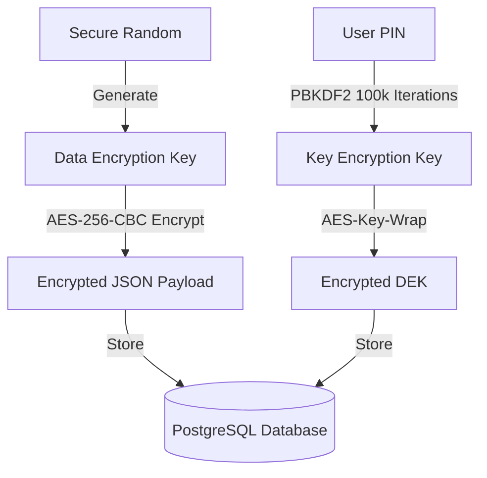

# Selene: Privacy-First Menstrual Health & Clinical Insights Platform

Selene is an enterprise-grade, privacy-first menstrual health and chronic physiological condition tracking platform. Designed for high-compliance environments, Selene combines zero-knowledge client-side encryption, clinical data interoperability, and machine learning cycle forecasting. The platform provides a secure bridge between patients tracking their reproductive health and healthcare providers needing interoperable, clinical-grade medical records.

---

## Technical Architecture

### 1. Cryptographic Envelope Security Model
To guarantee patient confidentiality, Selene utilizes a Zero-Knowledge envelope encryption architecture. All sensitive logging metrics and physiological data are encrypted on the client or during context-bound middleware before storage:
* **Key Encryption Key (KEK) Derivation:** A user's personal PIN is processed client-side via PBKDF2-HMAC-SHA256 (100,000 iterations) to derive a 256-bit KEK.
* **Double-Wrapped Data Encryption Key (DEK):** A unique symmetric AES-256 DEK is generated per-user in the client browser. The DEK is encrypted (wrapped) with the user's PIN-derived KEK before database storage.
* **Database-Level Cryptography:** Custom SQLAlchemy TypeDecorator wrappers (including EncryptedString, EncryptedInt, EncryptedFloat, and EncryptedJSON) automatically encrypt and decrypt schema properties on-the-fly inside PostgreSQL using the user's session-decrypted DEK.
* **PIN Verification:** Employs modern, GPU-resistant Argon2id (via argon2-cffi) for user PIN authentication.



### 2. Clinical Data Models & Standardized Coding
Selene is built from the ground up for clinical interoperability and compliance:
* **HL7 FHIR Observations:** Data export pipelines generate clinical logs structured under the HL7 FHIR (Fast Healthcare Interoperability Resources) Observation standard.
* **Standardized Medical Vocabularies:** All symptom logs map to international clinical terminologies:
  - **LOINC** codes for physiological measurements (e.g., Basal Body Temperature).
  - **SNOMED CT** concepts for tracking symptoms and chronic condition flags.
* **Compliance Foundations:** Complete architectural mapping for Digital Personal Data Protection (DPDP) Act 2023 compliance, featuring cryptographic consent logging and secure audit trails.

### 3. Machine Learning & Signal Processing Pipeline
* **Cycle Forecasting Regressor:** A gradient boosting regressor model trained to forecast cycle lengths using historical indicators, baseline statistics, and condition vectors.
* **Uncertainty Bounds:** Estimates cycle forecasts with standard deviation error ranges to reflect statistical variance (e.g., predicted cycle: 28 days ± 1.5).
* **Unsupervised Anomaly Detection:** An Isolation Forest model identifies multivariate outliers based on chronological reporting gaps and symptom intensity spikes.
* **Clinical Insights Engine:** A rule-based heuristic classifier validating chronic condition indicators (PCOS, PMDD, Endometriosis) against literature benchmarks (ACOG, Rotterdam 2004 Criteria, DSM-5 PMDD Criteria).

### 4. Infrastructure & Defensive Engineering
* **Secure Session Architecture:** Access tokens are stored in HttpOnly, SameSite=Strict cookies. Session revocation is enforced using a Redis-backed JTI (JWT ID) blacklist lookup.
* **Rate Limiting:** Implements Flask-Limiter for secure endpoint protection against brute force authentication attempts.
* **Production Deployment Wrapper:** Fully configured for Nginx reverse-proxy SSL termination and Gunicorn WSGI multi-worker environments.

---

## Directory Structure

```
selene/
├── .github/workflows/      # CI/CD GitHub Actions configurations
├── backend/
│   ├── backups/            # Database backups folder
│   ├── dataset/            # Training datasets for ML model
│   ├── migrations/         # Flask-Migrate database migrations
│   ├── app.py              # Flask Application factory
│   ├── auth.py             # Authentication and JWT validation
│   ├── config.py           # Configuration parameters
│   ├── gunicorn.conf.py    # Gunicorn WSGI configuration
│   ├── insights_engine.py  # Rule-based clinical insights engine
│   ├── models.py           # SQLAlchemy database schemas & crypto decorators
│   ├── pipeline.py         # ML data preprocessing pipelines
│   ├── predict.py          # ML inference endpoints and fallbacks
│   ├── run_prod.sh         # Production shell startup script
│   └── test_backend.py     # Backend unit and integration test suite
├── frontend/
│   ├── public/             # Static public assets
│   ├── src/
│   │   ├── components/     # React presentation and dashboard components
│   │   ├── utils/          # Client-side cryptography and API utilities
│   │   ├── App.jsx         # React application root
│   │   └── main.jsx        # Frontend entry point
│   ├── package.json        # Frontend dependencies
│   └── vite.config.js      # Vite build tool configuration
└── nginx/
    └── selene.conf         # Production Nginx reverse-proxy configuration
```

---

## Getting Started

### Prerequisites
* Python 3.11+
* Node.js 20.19+ or 22.12+
* PostgreSQL 15+
* Redis Server 6+

### Backend Setup
1. Navigate to the backend directory:
   ```bash
   cd backend
   ```
2. Create and activate a Python virtual environment:
   ```bash
   python -m venv venv
   source venv/bin/activate  # On Windows: .\venv\Scripts\activate
   ```
3. Install dependencies:
   ```bash
   pip install -r requirements.txt
   ```
4. Create a `.env` configuration file based on `.env.example` and set up database/Redis credentials.
5. Initialize the database schema and apply migrations:
   ```bash
   flask db upgrade
   ```
6. Run the integration and unit tests:
   ```bash
   pytest
   ```

### Frontend Setup
1. Navigate to the frontend directory:
   ```bash
   cd ../frontend
   ```
2. Install Node packages:
   ```bash
   npm install
   ```
3. Run the frontend development server:
   ```bash
   npm run dev
   ```

---

## Production Deployment

### 1. Build Frontend Static Assets
```bash
cd frontend
npm run build
```
Transfer the generated `frontend/dist/` assets folder to your production web directory (e.g., `/var/www/selene/dist`).

### 2. Configure Gunicorn WSGI
Use the provided production shell script to automatically run database migrations, clean expired tokens, and start Gunicorn:
```bash
chmod +x backend/run_prod.sh
./backend/run_prod.sh
```

### 3. Setup Nginx Reverse Proxy
Place the configuration file `nginx/selene.conf` into `/etc/nginx/sites-available/selene`. Ensure the static root points to your compiled frontend folder and setup SSL termination using Certbot.
