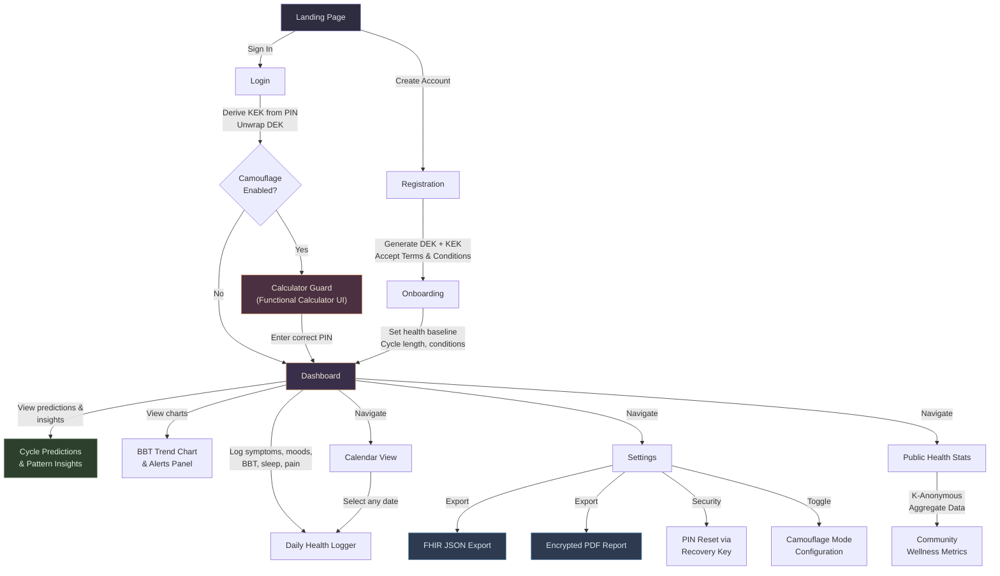

<p align="center">
  
</p>

<h1 align="center">S E L E N E</h1>

<p align="center">
  <em>Named after the Greek goddess of the Moon, Selene is a privacy-first menstrual health platform<br/>where your most intimate data remains mathematically yours.</em>
</p>

<p align="center">
  
  
  
  
  
</p>

<p align="center">
  <a href="#the-philosophy">Philosophy</a> &#183;
  <a href="#architecture">Architecture</a> &#183;
  <a href="#application-flow">App Flow</a> &#183;
  <a href="#clinical-intelligence">Clinical Intelligence</a> &#183;
  <a href="#getting-started">Getting Started</a> &#183;
  <a href="#deployment">Deployment</a>
</p>

---

## The Philosophy

Most health tracking apps ask you to trust them with your body's data. Selene was designed around a different premise: **what if the server itself could never read your data?**

Every symptom log, temperature reading, and mood entry is encrypted with a key derived from your personal PIN, a key that never touches the server in its raw form. The database stores ciphertext. The backend processes ciphertext. If someone breaches the server, they find noise.

This is not a feature. It is the foundation.

---

## Architecture

### Zero-Knowledge Encryption Model

Selene implements a layered envelope encryption scheme where the server is structurally prevented from accessing plaintext health data:

```
                          Client Browser
            +-----------------------------------------+
            |                                         |
            |   PIN ──> PBKDF2 (100,000 iter) ──> KEK |
            |                                         |
            |   Random ──> DEK (AES-256)              |
            |     |                                   |
            |     +──> Encrypt(symptoms, moods, BBT)  |
            |     +──> KEK wraps DEK                  |
            |                                         |
            +-----------------------------------------+
                              |
                        HTTPS (TLS 1.3)
                              |
            +-----------------------------------------+
            |           Flask API Server              |
            |                                         |
            |   Receives: encrypted blobs only        |
            |   Stores: ciphertext in PostgreSQL      |
            |   Session: HttpOnly JWT in cookies      |
            |   Revocation: Redis JTI blacklist       |
            |                                         |
            +-----------------------------------------+
```

**Key Design Decisions:**
- **PBKDF2-HMAC-SHA256** with 100,000 iterations for key derivation, resistant to GPU-accelerated brute force.
- **Custom SQLAlchemy TypeDecorators** (`EncryptedString`, `EncryptedInt`, `EncryptedFloat`, `EncryptedJSON`) handle transparent encryption at the ORM layer.
- **Argon2id** for PIN verification, the current winner of the Password Hashing Competition.
- **Double-wrapped DEK**: encrypted once with PIN-derived KEK, once with a server-held recovery key, enabling secure PIN resets without data loss.

### Session Security

| Layer | Implementation |
|:------|:---------------|
| Token Storage | HttpOnly, SameSite=Strict, Secure cookies |
| Token Revocation | Redis-backed JTI blacklist with TTL expiry |
| CSRF Protection | Double-submit cookie pattern on all mutating endpoints |
| Rate Limiting | Flask-Limiter with sliding window counters |
| Content Security | Strict CSP headers, HSTS, X-Frame-Options: DENY |

---

## Application Flow

The user journey through Selene is designed around progressive trust. Each layer reveals more functionality only after the previous layer has been secured.



### Screen Descriptions

| Screen | Purpose | Key Technical Detail |
|:-------|:--------|:---------------------|
| **Landing** | Marketing page with hero, value proposition, and camouflage demo | Static, no authentication required |
| **Registration** | Account creation with PIN setup and Terms & Conditions consent | Client-side DEK generation + KEK wrapping via PBKDF2 |
| **Login** | PIN-based authentication | KEK derived from PIN, DEK unwrapped, stored in session |
| **Calculator Guard** | Functional arithmetic calculator that disguises the app | Real math evaluation engine; correct PIN sequence unlocks the dashboard |
| **Onboarding** | First-time health baseline configuration | Collects cycle length, period duration, chronic condition flags |
| **Dashboard** | Central hub: daily logger, predictions, BBT chart, alerts | All displayed data is decrypted on-the-fly from encrypted database columns |
| **Calendar View** | Month-by-month log history with day-level detail | Click any date to view or edit that day's health entry |
| **Settings** | Account management, data exports, camouflage toggle, PIN reset | FHIR export, PDF generation, recovery key rotation |
| **Public Health** | Anonymous community wellness statistics | K-anonymity (K >= 5) enforced to prevent cohort re-identification |

---

## Clinical Intelligence


### Cycle Prediction Engine

Selene combines a trained **Gradient Boosting Regressor** with mathematical fallback heuristics:

| Component | Detail |
|:----------|:-------|
| Primary Model | scikit-learn GBR trained on 12,000 samples (R^2 = 0.66) |
| Feature Vector | `[cycle_baseline, period_baseline, has_PMOS, has_pmdd, has_endo, avg_sleep, avg_pain]` |
| Uncertainty | Dynamic standard deviation bounds reported with every prediction |
| Fallback | Weighted linear regression over historical period start dates |
| Conditions | PMOS, PMDD, and Endometriosis flags influence prediction with clinical disclaimers |

### Anomaly Detection

An **Isolation Forest** model monitors for irregular patterns across two dimensions:
- **Symptom intensity spikes** (aggregated mood + symptom + pain scores)
- **Logging frequency gaps** (days between consecutive entries)

Outliers are surfaced with contextual explanations ("Symptom score spike detected" vs. "Logging gap anomaly detected").

### Insights Engine

A deterministic rule-based engine evaluates daily logs against published clinical criteria:

| Condition | Standard | Method |
|:----------|:---------|:-------|
| PMOS Risk | Rotterdam 2004 Criteria | Cycle irregularity + symptom pattern analysis |
| PMDD Risk | DSM-5 Criteria | Luteal phase mood severity tracking |
| Endometriosis Flags | ACOG Guidelines | Pain pattern correlation with cycle phase |
| Ovulation Detection | Su et al. 2017 | Biphasic BBT thermal shift calculation |

### Data Interoperability

Health exports are generated in two clinical formats:
- **HL7 FHIR Observations** with LOINC and SNOMED CT coding for direct EHR integration
- **Password-encrypted PDF reports** formatted for OB/GYN consultations

---

## Project Structure

```
selene/
|
+-- backend/
|   +-- app.py                 # Flask application factory
|   +-- auth.py                # Authentication, JWT, key management
|   +-- models.py              # SQLAlchemy schemas + crypto type decorators
|   +-- insights_engine.py     # Clinical heuristic analysis engine
|   +-- predict.py             # ML inference + anomaly detection endpoints
|   +-- pipeline.py            # Feature engineering pipeline
|   +-- logs.py                # Daily log CRUD, FHIR export, PDF generation
|   +-- public_health.py       # K-anonymous aggregate health statistics
|   +-- gunicorn.conf.py       # Production WSGI configuration
|   +-- train_model.py         # Model training script
|   +-- test_backend.py        # 29-case integration test suite
|   +-- requirements.txt       # Python dependencies
|   `-- run_prod.sh            # Production startup script
|
+-- frontend/
|   +-- src/
|   |   +-- components/        # 24 React components
|   |   +-- utils/crypto.js    # Client-side PBKDF2 key derivation
|   |   +-- App.jsx            # Application root + routing
|   |   `-- main.jsx           # Entry point
|   +-- package.json           # Node dependencies
|   `-- vite.config.js         # Build configuration
|
+-- nginx/
|   `-- selene.conf            # Production reverse proxy + SSL config
|
+-- docs/                      # Supplementary documentation
|   +-- audit.md               # Production readiness checklist
|   +-- data_flow_mapping.md   # Encryption data flow diagrams
|   +-- ml.md                  # ML pipeline documentation
|   +-- irb_proposal.md        # IRB ethics proposal
|   `-- pitch_deck.md          # Investor pitch materials
|
`-- .github/workflows/
    `-- staging_deploy.yml     # CI/CD: test, build, deploy pipeline
```

---

## Getting Started

### Prerequisites

| Dependency | Version |
|:-----------|:--------|
| Python | 3.11+ |
| Node.js | 20.19+ or 22.12+ |
| PostgreSQL | 15+ |
| Redis | 6+ |

### Backend

```bash
git clone https://github.com/sharancreates/selene.git
cd backend
python -m venv venv
source venv/bin/activate          # Windows: .\venv\Scripts\activate
pip install -r requirements.txt

# Configure environment
cp .env.example .env              # Edit with your database and Redis credentials

# Initialize database
flask db upgrade

# Run tests (29 integration tests)
pytest

# Start development server
flask run
```

### Frontend

```bash
cd frontend
npm install
npm run dev                       # Starts on http://localhost:5173
```

---

## Deployment

Selene ships with production-ready configurations for Nginx + Gunicorn deployments.

### 1. Build Frontend

```bash
cd frontend && npm run build
# Transfer dist/ to your web server root
```

### 2. Start Backend with Gunicorn

```bash
chmod +x backend/run_prod.sh
./backend/run_prod.sh
# Runs migrations, cleans expired tokens, starts Gunicorn workers
```

### 3. Configure Nginx

Place `nginx/selene.conf` in `/etc/nginx/sites-available/` and provision SSL certificates:

```bash
sudo certbot --nginx -d yourdomain.com
sudo systemctl restart nginx
```

### CI/CD

Every push to `main` or `staging` triggers a GitHub Actions pipeline that:
1. Spins up a PostgreSQL 15 service container
2. Installs dependencies and runs the full 29-test backend suite
3. Builds production frontend assets with Vite
4. Deploys to staging via SCP (when SSH secrets are configured)

---

<p align="center">
  <sub>Built with conviction that privacy is not a feature to be toggled, but a right to be architected.</sub>
</p>
