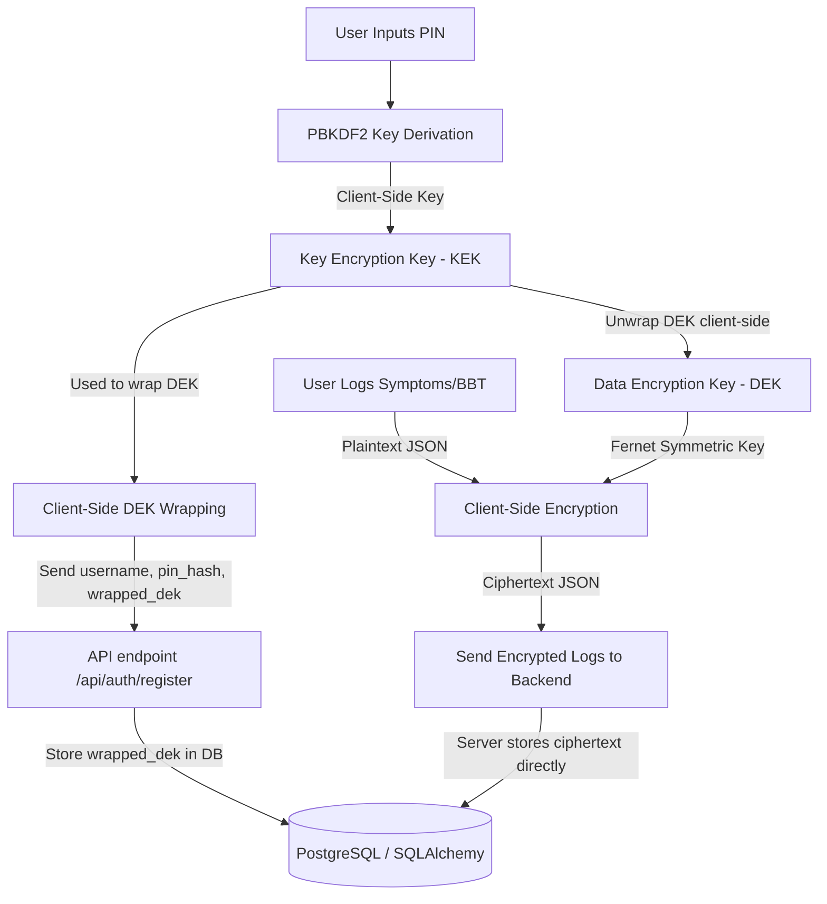

# Selene Cryptographic Data Flow & Architecture

This document maps the lifecycle of user information, showing exactly where data is decrypted and highlighting the client-side/server-side cryptographic boundaries.

---

## 1. Cryptographic Key Hierarchy

Selene employs a Multi-Layered Envelope Encryption architecture to secure all personal health records (PHRs) in a Zero-Knowledge manner.

| Key | Type | Derivation / Generation Method | Location | Scope |
|---|---|---|---|---|
| **User Passcode (PIN)** | User Secret | Minimally 6-digit passcode | User Memory | Never sent to server |
| **Key Encryption Key (KEK)** | Symmetric (AES-256) | PBKDF2-HMAC-SHA256 (100,000 iterations) salted with username | Client Memory | Client-side only; transient |
| **Data Encryption Key (DEK)** | Symmetric (AES-256) | Cryptographically secure random bytes (Fernet key) | Client Memory | Encrypts/decrypts user health logs |
| **Wrapped DEK (PIN)** | Ciphertext | `AES_GCM_Wrap(KEK_PIN, DEK)` | DB (`users.encrypted_dek_pin`) | Persisted server-side |
| **Wrapped DEK (Recovery)** | Ciphertext | `AES_GCM_Wrap(KEK_Recovery, DEK)` | DB (`users.encrypted_dek_recovery`) | Persisted server-side |

---

## 2. Step-by-Step Data Lifecycle

### A. Authentication & Sign-Up
1. **User Input:** User chooses a username, PIN, and requests registration.
2. **Client-Side Derivation:**
   - Salt = `username` + `"selene-salt-suffix"`
   - `KEK_PIN` = `PBKDF2(PIN, Salt, 100000, 32 bytes)`
3. **Recovery Key Generation:**
   - A secure 32-character recovery key is randomly generated in the client browser.
   - `KEK_Recovery` = `PBKDF2(RecoveryKey, username + "selene-recovery-salt-suffix", 100000, 32 bytes)`
4. **DEK Wrapping:**
   - A raw `DEK` is generated client-side: `DEK = Fernet.generate_key()`.
   - `DEK` is wrapped using `KEK_PIN` -> `encrypted_dek_pin`.
   - `DEK` is wrapped using `KEK_Recovery` -> `encrypted_dek_recovery`.
5. **Ingestion & Server Handshake:**
   - The client posts the `username`, `pin_hash` (PBKDF2 of PIN), `encrypted_dek_pin`, and `encrypted_dek_recovery` to `/api/auth/register`.
   - **The server never receives the plaintext PIN or raw DEK.**

### B. Logging a Daily Entry
1. **Log Input:** The user adjusts sliders for symptoms and inputs Basal Body Temperature (BBT).
2. **Encryption Boundary:**
   - The frontend decrypts the user's DEK in-memory using the active session's KEK.
   - The frontend encrypts each attribute (e.g. `cramps: 80%`, `bbt: 98.4`) using `DEK` via AES-128-CBC (Fernet standard).
3. **Transmission:**
   - The encrypted payload is transmitted over HTTPS to `/api/logs/sync`.
4. **Storage:**
   - SQLAlchemy accepts the ciphertext fields.
   - Custom `TypeDecorator` columns (`EncryptedString`, `EncryptedFloat`, `EncryptedJSON` inside `models.py`) write the ciphertext fields directly to the PostgreSQL database.
   - **Server administrators see only unreadable base64 block ciphertext in the database.**

### C. Dashboard Render & Predictions
1. **Fetch Logs:** The client requests logs from `/api/logs`. The server returns the encrypted rows.
2. **Decryption:** The client decrypts the logs in-memory using the local `DEK` and displays them in charts and calendars.
3. **ML Prediction Cycle:**
   - For ML cycle forecasting, only the dates of cycles (non-sensitive timestamps) are processed by the backend ML pipeline to calculate standard deviations and forecasts.
   - Clinical symptom content is kept strictly local/decrypted only on client browser virtual memory.
