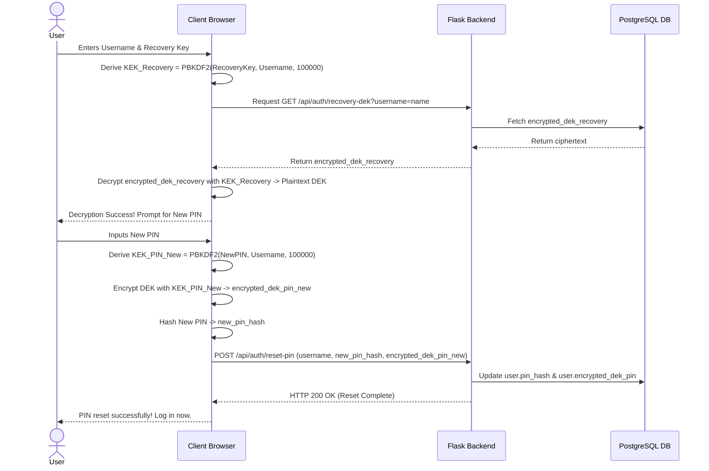

# User PIN Recovery Cryptographic Flow

This document details the recovery path when a user loses their passcode (PIN). It illustrates how Selene allows users to regain access to their encrypted logs without the server ever knowing their PIN or storing their decrypted health record.



---

## Cryptographic Operations & API Enforcements

### 1. Verification of the Recovery Key
When a user forgets their PIN, they locate the 32-character recovery key saved during registration.
The client browser executes:
```javascript
const salt = username + "selene-recovery-salt-suffix";
const KEK_recovery = await pbkdf2(recoveryKeyInput, salt, 100000, 32);
```

### 2. Fetching the wrapped DEK
The client requests the wrapped DEK from the server:
`GET /api/auth/recovery-dek?username=username`
*Response:*
```json
{
  "encrypted_dek_recovery": "gAAAAABm..."
}
```

### 3. Client-Side Decryption of the DEK
The browser uses `KEK_recovery` to decrypt `encrypted_dek_recovery`:
```javascript
const rawDEK = decryptFernet(encrypted_dek_recovery, KEK_recovery);
```
If this decryption fails (e.g. invalid recovery key), the recovery key is wrong, and the flow halts. No data is leaked.

### 4. Re-wrapping with New PIN
Upon successful decryption, the browser prompts the user to enter a new PIN.
The browser then derives the new KEK and wraps the raw DEK:
```javascript
const newSalt = username + "selene-salt-suffix";
const KEK_PIN_new = await pbkdf2(newPinInput, newSalt, 100000, 32);
const encrypted_dek_pin_new = encryptFernet(rawDEK, KEK_PIN_new);
const new_pin_hash = await sha256(newPinInput);
```

### 5. Backend Server Update
The browser sends the updated wrapped keys to `/api/auth/reset-pin`:
*Payload:*
```json
{
  "username": "username",
  "new_pin_hash": "new_pin_hash_hex",
  "encrypted_dek_pin": "new_wrapped_dek_ciphertext"
}
```
The server validates that the username exists and updates the database fields:
*   `User.pin_hash = new_pin_hash`
*   `User.encrypted_dek_pin = encrypted_dek_pin`

The recovery is complete. The user logs in using the new PIN, generating the identical decrypted `DEK` in-memory.
